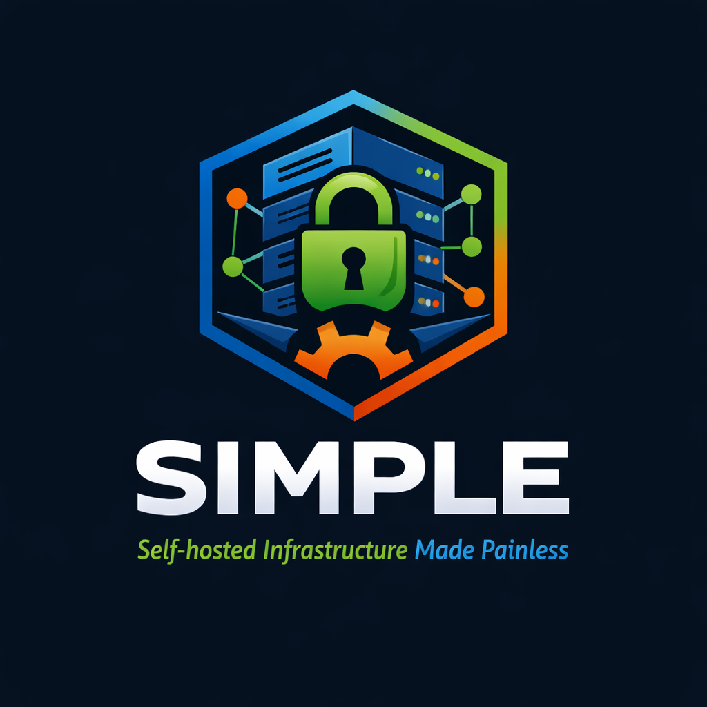

<p align="center">
  
</p>

<p align="center">
  Hardened Linux • Secure Docker • Zero Trust • One Command Deployments
</p>

<p align="center">
  
  
  
  
</p>

---

<h1 align="center">
  WORK IN PROGRESS
</h1>

---

## What is SIMPLE?

**SIMPLE** is an opinionated, security-first self-hosting framework for Linux.

It transforms a bare Linux machine into a hardened, production-grade self-hosting platform using:

- Secure OS baselines
- Zero-trust networking
- Hardened Docker runtime
- Isolated service stacks
- Encrypted secrets
- Automated audits
- One-command deployments

SIMPLE is designed for:
- Home labs
- VPS servers
- Edge servers
- Small businesses
- Makers and engineers

---

## Philosophy

SIMPLE follows three principles:

- **Secure by Default**
- **Composable by Design**
- **Auditable by Nature**

No Kubernetes.
No YAML sprawl.
No fragile bash scripts.
No copy-paste infrastructure.

Just reproducible, hardened self-hosting.

---

## Quick Start

```sh
# 1. Clone & setup
git clone https://github.com/MadhbhavikaR/SIMPLE.git
cd SIMPLE
chmod +x scripts/setup.sh
./scripts/setup.sh

# 2. Activate & run wizard
source activate
sudo python src/main.py

python -m pytest tests/ -v
```


### TODO:
first ask for user which would be used for volume 
PrerequisiteDetector replace with which command may be, how do i get the installed app which ufw vs sudo which ufw give different results, what the definative way?

1. Add support for custom files overrides/<path>/file.<ext>.jinja and rename <service>.yaml.jinja -> service.yaml.jinja 
2.use the detected os to have customization to move out of diet pi
3.add custome notifications like telegram, as service

support enums in yaml, check about in authelia
support service validation in about
create a yaml schema if possible
create dynamic prompts with validations
provide option to select variations
move away from hardcoded strategy
