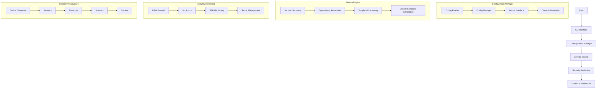
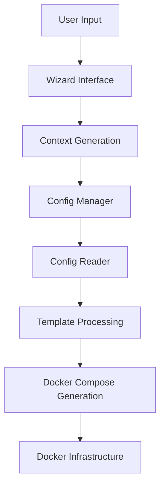
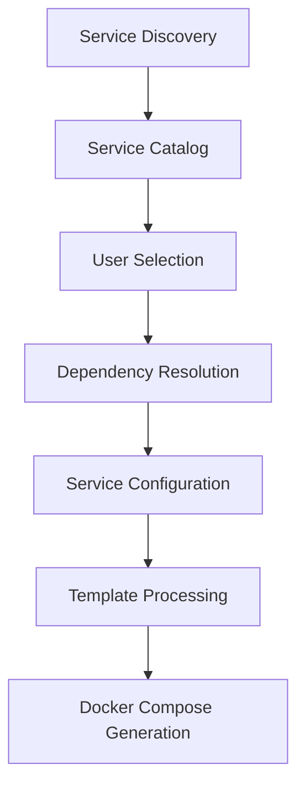
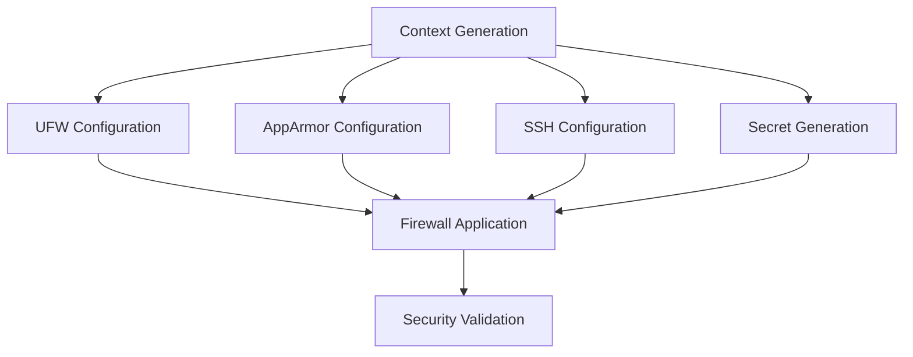

# Architecture: SIMPLE

## System Overview

SIMPLE is a modular, security-first self-hosting framework designed to simplify the deployment and management of containerized services on Linux systems. The architecture follows a layered approach with clear separation of concerns between configuration, service orchestration, and security hardening.

### Core Principles

1. **Modular Design**: Each component has a single responsibility
2. **Security by Default**: Security measures are built-in, not optional
3. **Infrastructure as Code**: Configuration is version-controlled and reproducible
4. **Zero-Trust Architecture**: Services are isolated and communicate securely
5. **User-Friendly Interface**: Interactive CLI with clear feedback

## Architecture Diagram



## Component Descriptions

### Configuration Manager

#### Config Reader
- **Purpose**: Load and parse configuration files and templates
- **Responsibilities**:
  - Read YAML configuration files
  - Load Jinja2 templates
  - Validate configuration structure
  - Provide template rendering capabilities
- **Dependencies**: PyYAML, Jinja2
- **Technologies**: Python, YAML, Jinja2 templates

#### Config Manager
- **Purpose**: Manage user configuration and context
- **Responsibilities**:
  - Interactive configuration wizard
  - Context generation and management
  - Service discovery and selection
  - Configuration validation
- **Dependencies**: Questionary, Config Reader
- **Technologies**: Python, Questionary, YAML

#### Wizard Interface
- **Purpose**: Provide user-friendly configuration interface
- **Responsibilities**:
  - Interactive prompts for user input
  - Input validation and error handling
  - Progress feedback and status updates
  - Help and documentation display
- **Dependencies**: Questionary
- **Technologies**: Python, Questionary

#### Context Generation
- **Purpose**: Create and manage execution context
- **Responsibilities**:
  - Build configuration context
  - Store user preferences
  - Manage runtime state
  - Provide context to other components
- **Dependencies**: Config Manager
- **Technologies**: Python, Dictionary-based context

### Service Engine

#### Service Discovery
- **Purpose**: Discover available services and their metadata
- **Responsibilities**:
  - Scan service directories
  - Load service metadata from about.yaml
  - Build service catalog
  - Validate service configurations
- **Dependencies**: Config Reader
- **Technologies**: Python, YAML

#### Dependency Resolution
- **Purpose**: Resolve service dependencies automatically
- **Responsibilities**:
  - Parse dependency definitions
  - Resolve dependency chains
  - Validate dependency compatibility
  - Generate dependency graphs
- **Dependencies**: Service Discovery
- **Technologies**: Python, Graph algorithms

#### Template Processing
- **Purpose**: Process Jinja2 templates for service generation
- **Responsibilities**:
  - Load and validate templates
  - Apply context to templates
  - Handle template includes and inheritance
  - Generate final configuration files
- **Dependencies**: Config Reader, Context Generation
- **Technologies**: Python, Jinja2

#### Docker Compose Generation
- **Purpose**: Generate complete Docker Compose infrastructure
- **Responsibilities**:
  - Create docker-compose.yaml files
  - Generate service configurations
  - Create network definitions
  - Set up volume mappings
  - Configure secret management
- **Dependencies**: Template Processing, Dependency Resolution
- **Technologies**: Python, YAML, Docker Compose

### Security Hardening

#### UFW Firewall
- **Purpose**: Configure and manage firewall rules
- **Responsibilities**:
  - Generate firewall rules
  - Apply UFW configurations
  - Validate firewall setup
  - Provide firewall status
- **Dependencies**: System utilities
- **Technologies**: Python, UFW

#### AppArmor
- **Purpose**: Configure application-level security profiles
- **Responsibilities**:
  - Detect AppArmor availability
  - Generate security profiles
  - Apply AppArmor configurations
  - Validate profile installation
- **Dependencies**: System utilities
- **Technologies**: Python, AppArmor

#### SSH Hardening
- **Purpose**: Secure SSH configurations
- **Responsibilities**:
  - Generate secure SSH configurations
  - Apply SSH hardening measures
  - Validate SSH security
  - Provide SSH status
- **Dependencies**: System utilities
- **Technologies**: Python, SSH

#### Secret Management
- **Purpose**: Manage sensitive credentials securely
- **Responsibilities**:
  - Generate secure secrets
  - Store secrets securely
  - Manage Docker secrets
  - Rotate secrets as needed
- **Dependencies**: Cryptography
- **Technologies**: Python, Docker Secrets

### Docker Infrastructure

#### Docker Compose
- **Purpose**: Define and manage containerized services
- **Responsibilities**:
  - Service definitions
  - Network configurations
  - Volume mappings
  - Secret references
- **Dependencies**: Docker Engine
- **Technologies**: Docker Compose, YAML

#### Services
- **Purpose**: Individual containerized applications
- **Responsibilities**:
  - Service execution
  - Resource management
  - Health monitoring
  - Logging
- **Dependencies**: Docker Compose
- **Technologies**: Docker, Containerization

#### Networks
- **Purpose**: Isolated service communication
- **Responsibilities**:
  - Network isolation
  - Service discovery
  - Secure communication
  - Traffic routing
- **Dependencies**: Docker Compose
- **Technologies**: Docker Networks

#### Volumes
- **Purpose**: Persistent data storage
- **Responsibilities**:
  - Data persistence
  - Volume management
  - Backup and restore
  - Access control
- **Dependencies**: Docker Compose
- **Technologies**: Docker Volumes

#### Secrets
- **Purpose**: Secure credential management
- **Responsibilities**:
  - Secret storage
  - Access control
  - Rotation management
  - Audit logging
- **Dependencies**: Docker Compose
- **Technologies**: Docker Secrets

## Data Flow

### Configuration Flow



### Service Selection Flow



### Security Flow



## API Design

### Configuration API

```python
class ConfigManager:
    def wizard() -> Dict[str, Any]:
        """Run interactive configuration wizard"""

    def detect_system() -> None:
        """Detect system information and configuration"""

    def generate_password(length: int = 32) -> str:
        """Generate secure random password"""

    def save_settings() -> None:
        """Save configuration to settings file"""
```

### Service Engine API

```python
class DockerEngine:
    def select_services(allow_incremental: bool = True) -> None:
        """Interactive service selection"""

    def generate() -> None:
        """Generate complete infrastructure"""

    def _resolve_dependencies(service_name: str, selected_services: set) -> List[str]:
        """Resolve service dependencies"""

    def _write_compose_file() -> None:
        """Generate docker-compose.yaml file"""
```

### Security API

```python
class UfwEnforcer:
    def process() -> List[str]:
        """Generate UFW rules"""

    def apply(rules: List[str], dry_run: bool = True) -> bool:
        """Apply UFW rules"""

class AppArmorEnforcer:
    def detect() -> bool:
        """Detect AppArmor availability"""

    def process() -> Dict[str, Any]:
        """Generate AppArmor profiles"""

    def apply(plan: Dict[str, Any], dry_run: bool = True) -> bool:
        """Apply AppArmor profiles"""

class SSHEnforcer:
    def __init__(context: Dict[str, Any]):
        """Initialize SSH enforcer with context"""

    def apply() -> bool:
        """Apply SSH hardening"""
```

## Data Model

### Configuration Context

```python
{
    "PUID": "1000",
    "PGID": "1000",
    "PUSER": "user",
    "PGROUP": "user",
    "BASE_DIR": "/path/to/base",
    "VOLUMES_DIR": "/path/to/volumes",
    "DOCKER_DIR": "/path/to/docker",
    "SCRIPTS_DIR": "/path/to/scripts",
    "DOMAIN": "example.com",
    "EMAIL": "admin@example.com",
    "SUBDOMAINS": "service1,service2",
    "TZ": "UTC",
    "HOSTNAME": "hostname",
    "UMASK": "0022",
    "SWAG_STAGING": "false",
    "AUTO_GENERATE_PASSWORDS": True,
    "SERVICES": {
        "service1": {
            "display_name": "Service 1",
            "description": "Description",
            "version": "1.0",
            "category": "category",
            "template": "default.yaml.jinja"
        }
    }
}
```

### Service Definition

```python
{
    "name": "service-name",
    "display_name": "Service Name",
    "description": "Service description",
    "version": "1.0.0",
    "category": "category",
    "url": "https://service-url.com",
    "docker_image": "service/image:tag",
    "dependencies": ["dependency1", "dependency2"],
    "ports": {
        "80": "8080"
    },
    "alternatives": ["default", "minimal"],
    "prompts": [
        {
            "name": "SECRET_KEY",
            "description": "Service secret key",
            "type": {
                "enum": ["SECRET"]
            },
            "required": true
        }
    ],
    "networks": {
        "enum": ["proxy", "backend"]
    }
}
```

## Security Architecture

### Authentication and Authorization

- **User Authentication**: CLI-based authentication
- **Service Authorization**: Role-based access control
- **Secret Management**: Docker secrets with file-based encryption
- **Access Control**: File system permissions and ownership

### Network Security

- **Firewall Rules**: UFW-based network filtering
- **Network Isolation**: Docker network segmentation
- **Service Exposure**: Controlled port mapping
- **TLS Encryption**: SWAG reverse proxy with Let's Encrypt

### Data Protection

- **Secret Encryption**: File-based encryption for sensitive data
- **Volume Encryption**: Optional volume encryption
- **Backup Strategy**: Regular backup procedures
- **Audit Logging**: Comprehensive logging and monitoring

## Scalability Considerations

### Horizontal Scaling

- **Service Replication**: Multiple instances of stateless services
- **Load Balancing**: Reverse proxy with load balancing
- **Resource Allocation**: Docker resource constraints
- **Auto-Scaling**: Manual scaling with monitoring alerts

### Vertical Scaling

- **Resource Limits**: Configurable CPU and memory limits
- **Service Optimization**: Performance tuning for services
- **Monitoring**: Resource usage monitoring
- **Alerting**: Threshold-based notifications

### Performance Optimization

- **Caching**: Service-level caching strategies
- **Resource Management**: Efficient resource allocation
- **Network Optimization**: Optimized network configurations
- **Storage Optimization**: Efficient volume management

## Architectural Decisions

| Decision | Alternatives | Rationale |
|----------|--------------|-----------|
| **CLI-First Interface** | Web UI, Desktop App | Better for automation, scripting, and remote management |
| **Modular Architecture** | Monolithic, Microservices | Balance between flexibility and complexity |
| **Template-Based Generation** | Code Generation, DSL | Easier maintenance and customization |
| **YAML Configuration** | JSON, TOML, HCL | Human-readable with good nested structure support |
| **Docker Compose** | Kubernetes, Podman | Simplicity and wide adoption |
| **Context-Based State** | Global Config, Environment Variables | Better organization and scoping |
| **Dependency Resolution** | Manual Specification | Ensures proper service ordering |
| **Security by Default** | Optional Security | Security should never be optional |

## Navigation

- 🏠 Home: [README](../../README.md)
- ⬅ Previous: [Tech Stack](tech-stack.md)
- ➡ Next: [Requirements](requirements.md)

## Traceability

- **Related ADRs**: architecture-decisions.md
- **Related Design Docs**: None
- **Related APIs**: ConfigManager, DockerEngine, Security APIs
- **Related Data Models**: Configuration Context, Service Definition
