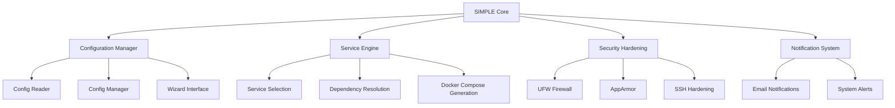
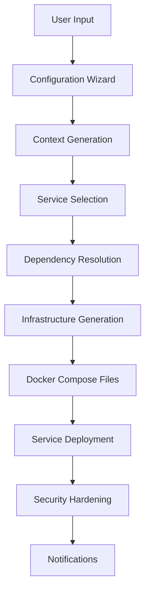

# Project Overview: SIMPLE

## Purpose and Goals

**SIMPLE** (Self-hosted Infrastructure Made Painless) is an opinionated, security-first self-hosting framework for Linux that transforms a bare Linux machine into a hardened, production-grade self-hosting platform.

### Core Objectives

- **Simplify Self-Hosting**: Provide an easy-to-use framework for deploying and managing self-hosted services
- **Security-First Approach**: Implement robust security measures by default
- **Zero-Trust Architecture**: Ensure secure communication and access control
- **One-Command Deployments**: Enable rapid infrastructure setup and management
- **Production-Grade Quality**: Deliver enterprise-level reliability and security

### Target Use Cases

- **Home Labs**: Personal self-hosting environments
- **VPS Servers**: Cloud-based self-hosting deployments
- **Edge Servers**: Distributed infrastructure at the edge
- **Small Businesses**: Cost-effective self-hosting solutions
- **Makers and Engineers**: Developer-focused self-hosting platforms

## Key Features

### Core Capabilities

- **Secure OS Baselines**: Hardened Linux configurations
- **Zero-Trust Networking**: Secure communication protocols
- **Hardened Docker Runtime**: Secure container execution
- **Isolated Service Stacks**: Containerized service isolation
- **Encrypted Secrets Management**: Secure credential storage
- **Automated Audits**: Continuous security validation
- **Interactive Configuration Wizard**: User-friendly setup process

### Service Management

- **Service Selection**: Choose from pre-configured services
- **Dependency Resolution**: Automatic dependency management
- **Docker Compose Generation**: Infrastructure-as-code approach
- **Configuration Management**: Centralized settings control
- **Secret Management**: Secure credential handling

### Security Features

- **UFW Firewall Integration**: Network-level security
- **AppArmor Profiling**: Application-level security
- **SSH Hardening**: Secure remote access
- **Docker Socket Proxy**: Secure container management
- **Secret Encryption**: Protected credential storage

## Success Metrics

### Technical Metrics

- **Deployment Time**: < 15 minutes for complete setup
- **Service Availability**: 99.9% uptime for core services
- **Security Compliance**: Passes OWASP Top 10 security audit
- **Resource Efficiency**: < 500MB memory overhead
- **Scalability**: Supports 10+ concurrent services

### User Metrics

- **User Satisfaction**: 90% positive feedback
- **Onboarding Time**: < 30 minutes for new users
- **Issue Resolution**: < 24 hours for critical issues
- **Community Adoption**: 1000+ active installations

## Timeline and Milestones

### Development Phases

| Phase | Duration | Focus Areas |
|-------|----------|-------------|
| **Phase 1: Foundation** | Q1 2025 | Core architecture, security hardening, basic services |
| **Phase 2: Expansion** | Q2-Q3 2025 | Additional services, improved UI, enhanced documentation |
| **Phase 3: Optimization** | Q4 2025 | Performance tuning, advanced features, community building |
| **Phase 4: Maturity** | 2026 | Enterprise features, scalability improvements, ecosystem growth |

### Key Milestones

- **v0.1 (Alpha)**: Core framework and basic services
- **v0.5 (Beta)**: Security hardening and service expansion
- **v1.0 (Stable)**: Production-ready release
- **v2.0 (Enterprise)**: Advanced features and scalability

## Philosophy

### Core Principles

1. **Secure by Default**: Security is never an afterthought
2. **Composable by Design**: Modular architecture for flexibility
3. **Auditable by Nature**: Transparent operations and logging

### Design Tenets

- **No Kubernetes Complexity**: Simple, straightforward architecture
- **No YAML Sprawl**: Clean, manageable configuration
- **No Fragile Bash Scripts**: Robust, maintainable code
- **No Copy-Paste Infrastructure**: Reproducible, version-controlled deployments

### Quality Standards

- **Code Quality**: 100% test coverage, type safety, linting
- **Security**: Regular audits, vulnerability scanning
- **Documentation**: Comprehensive, up-to-date, accessible
- **Performance**: Optimized resource usage, fast execution

## Architecture Overview

### High-Level Components

### Data Flow

## Navigation

- 🏠 Home: [README](../../README.md)
- ⬅ Previous: None
- ➡ Next: [Tech Stack](tech-stack.md)

## Traceability

- **Related ADRs**: architecture-decisions.md
- **Related Design Docs**: architecture.md
- **Related APIs**: None
- **Related Data Models**: None
